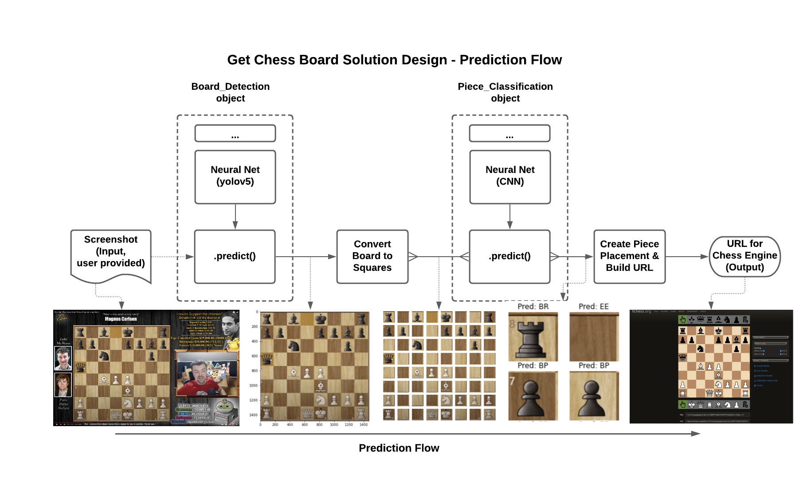

# Get Chess Board

    Watching chess on YouTube:
          
          -But why not  <random_chess_move>??  
    
    The video moves on without hearing you…

    In a parallel universe:
        The video still moves on without hearing you… but you open that position on a chess engine.

## 1. Motivation and Goals
Videos on YouTube provide a lot of content for enjoying chess games played and commented on by extraordinary players. The videos also happen to be fast and provide a lot of exposure to chess but they sometimes lack in commentary regarding alternative moves - mostly rightfully so. In such cases, the ability to have an analysis board of the current position open up in a browser could help the viewer study the game more effectively and better answer “what-if” questions that they might have.

With this project, I aim to decrease the friction to study a chess game played on a video platform. This could:
1.	Shorten the feedback-loop on learning by making the analysis board (an infallible guide for almost all purposes) available quicker.
2.	Introduce a programmatic tool for capturing chess games from videos.
3.	Make watching chess videos more fun!

The project will take a screenshot of a chess game on a video platform and return a string that represents the piece placement. 

## 2. Project in Pictures

## 3. Project Contributions

1. End-to-end neural network based piece
placement generation from a screenshot. 
2. Transfer learning from an object detection model ([yolov5](https://github.com/ultralytics/yolov5) via [yolo](https://pjreddie.com/media/files/papers/yolo.pdf) using PyTorch.
3. Bottom up training of a fully connected classifier (using Tensorflow)
4. Creation of chess specific (& easily extendable) platform independent GUI.

## 4. More Information

More information about the project is available in the [presentation](Project%20Presentation%20-%20Get%20Chess%20Board.pdf) and the [report](Project%20Report%20-%20Get%20Chess%20Board.pdf) (even more detail and discussion of paths forward).

Notebook 1 through 3 contain: end-to-end demonstration of the process in [Part 1 Demo](<Get Chess Board - Part 1 - Objective - Methodology and  End-to-End Demonstration.ipynb>); demonstrations of GUI in [Part 2 - Board GUI](<Get Chess Board - Part 2a - Data Acquisition and Exploration for Chessboard Detection.ipynb>) and [Part 2 - Square GUI](<Get Chess Board - Part 2b - Data Acquisition and Exploration for Piece Identification.ipynb>); and demonstration of the detection and classification objects in [Part 3 - Board Detection](<Get Chess Board - Part 3a - Chessboard Detection - Train + Predict.ipynb>) and [Part 3 - Piece Classification](<Get Chess Board - Part 3b - Piece Classification - Train + Predict.ipynb>).

## 5. Steps to Download the Repo & Steps After Download

Best way to download the repo is to clone it with its submodules:

    git clone --recurse-submodules https://github.com/artunart/Get-Chess-Board

Another option is as follows: first clone the repo, then clone the submodule.
    
    git clone https://github.com/artunart/Get-Chess-Board
    cd Get-Chess-Board`
    git submodule update --init` 

After cloning the repo with the yolov5 submodule, move __init__.py from the repo root to yolov5. This is for the detection object to have access to yolov5.
    
    mv __init__.py yolov5
## 6. Notes on Preparing the Environment

Environment requirements can be found in req_conda.txt (list of conda packages), requirements.txt (for pip install) and  req_conda_list.txt (output of conda list) for different uses.

### Suggestion for setting up the environment on Apple Silicon M1 (macOS Monterey)

I've decided to include the specifics for this OS because it took a lot of trial and error for me to get this right. I wanted to share a solution that worked.

Start with a clean conda environment in [miniforge](https://github.com/conda-forge/miniforge#download): <env_name>

	%conda install python=3.8
	%conda install -c apple tensorflow-deps==2.7.0
	%pip install tensorflow-macos==2.7.0
	%pip install tensorflow-metal==0.3.0
	%pip install torch==1.9.0 torchvision==0.10.0 torchaudio==0.9
	%conda install --file req_conda.txt
	%pip install -r requirements.txt
	%python -m ipykernel install --user --name=<env_name>
    Modify your environment's kernel.json file, if necessary, to point to the correct python executable
    %python -m jupyterlab

For other systems, I've included req_conda_list.txt as an extra reference.